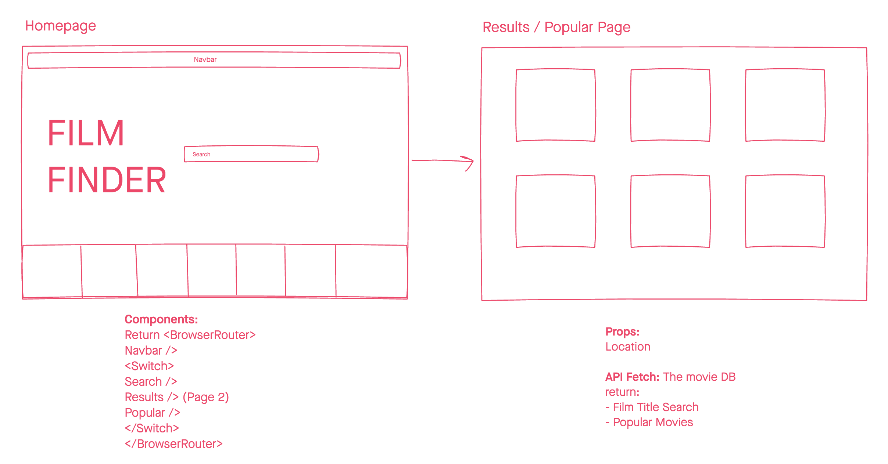

###  General Assembly, Software Engineering Immersive

# Project-2 - Film Finder


## Overview

## Brief: 
Build a multi-page React application that consumes a public RESTful API, uses React-Router and deploy it using GitHub pages.

## Timeframe: 
48 Hours

## About the Project: 
Film Finder is a simple app that allows users to search for films by titles and get information on those movies, such as Jaws. Additionally, users are able to browse The Movie DB’s popular movies and find out information on them too.

You can check out the deployed project [here](https://nalderson.github.io/project-2/)!

Technologies used:
- HTML5
- JavaScript
- Git
- GitHub
- SASS
- Bulma
- React
- React-Router
- RESTful APIs
- Axios

## Planning:
Prior to starting the project, we researched which API to use (The Movie DB)  and researched it’s endpoints to ensure we planned what we were fetching. The API was a litt;e unuser friendly so this was a key step. We then moved onto drawing out our wireframes - we wanted to keep the design simple and easy to use, as it was our first time using React and Bulma. 



## The Build:

### The Homepage: 
We wanted to make the homepage simple, yet vibrant so it’s inviting to the user. We added a title, a search bar and a carousel at the bottom which displays popular movies. This carousel also doubles up as a link to which users can click and look at The Movie DB’s popular films. 

The carousel was a React Library which we imported and dynamically fetched the popular movie posters from the API.

```
  useEffect(() => {
    axios.get(`https://api.themoviedb.org/3/movie/popular?api_key=${process.env.apikey}&language=en-US&page=1`)
      .then(({ data }) => {
        updateResults(data.results)
      })
  }, [])
```
```
      <Slider {...settings} style={sliderStyle}>
        {popular.map(result => {
          return <Link to={{ pathname: '/project-2/popular' }}
            className="popular-movies" key={popular.id}>
            
          </Link>
        })}
      </Slider>
```

### Results / Popular Page:
Depending on what film title the user searched, the results page would return any movie card titles that included that word. These would be displayed in card format showing the movie poster, then when the user hovers over it the card would flip and reveal more information about the movie, including it’s release date and a brief overview. 

```
export default function Results({ location }) {

  const [results, updateResults] = useState([])

  useEffect(() => {
    axios.get(`https://api.themoviedb.org/3/search/movie?query=${location.state.inputText}&api_key=${process.env.apikey}`)
      .then(({ data }) => {
        updateResults(data.results)
      })
  }, [])

  return <div className="cards">
    {results.map(result => {
      return <div className="card" key={result.id}>
        
        <div className="card-inner">
          <div className="card-back">
            <h1>{result.original_title}</h1>
            <h5>Release Date: {result.release_date}</h5>
            <p>{result.overview}</p>
          </div>
        </div>
      </div>
    })}
  </div >
}
```

Additionally, if users clicked on the carousel on the Homepage or the link in the Navbar, this would display the Popular Films in the same format. 

## Wins:
- Fetching what we needed for The Movie DB API
- Using a React library for the first time 
- Implementing the Custom CSS card flip

## Challenges:
- We were instructed to build the project using live share on VS Code, however there was an issue with live sharing on Emily’s computer. To remedy this, we instead pair programmed the entire project over zoom and coded together. This really made us utilize our communication skills and error spotting
- The Movie DB API was a little more complicated than we realised. There were a lot of different endpoints, with nested fields so it took some time to work this out
- The short time frame was a challenge, as the above technical issues slowed us down meaning we weren’t able to implement as many stretch goals as we intended 

## Future Features:
- Ability to search by actor, as well as title 
- Potential to filter movies by genre
- Include another API such as IMDB in order to display movie ratings etc 
